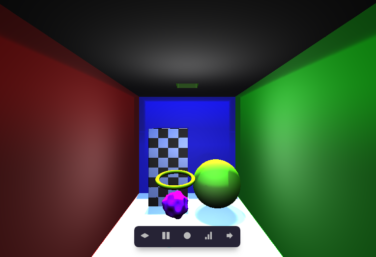

# simple-shaders
A simple project written in GLSL pixel shaders.

Functionalities:

|           Features           | Implemented |
|:----------------------------:|:-----------:|
| Perspective Projection       |      X      |
| Phong Shading                |      X      |
| Camera movement and rotation |      X      |
| Sharp shadows                |      X      |
| Tone mapping                 |      X      |
| PBR shading                  |             |
| Soft shadows                 |      X      |
| Sharp reflections            |      X      |
| Glossy reflections           |             |
| Refractions                  |             |
| Caustics                     |             |
| SDF Ambient Occlusions       |      X      |
| Texturing                    |             |
| Simple game                  |             |
| Progressive path tracing     |             |
| Basic post-processing        |             |
| Advanced post-processing     |             |
| Screen space reflections     |             |
| Screen space AO              |      X      |
| Simple own SDF               |      X      |
| Advanced own SDF             |             |
| Animated SDF                 |      X      |9